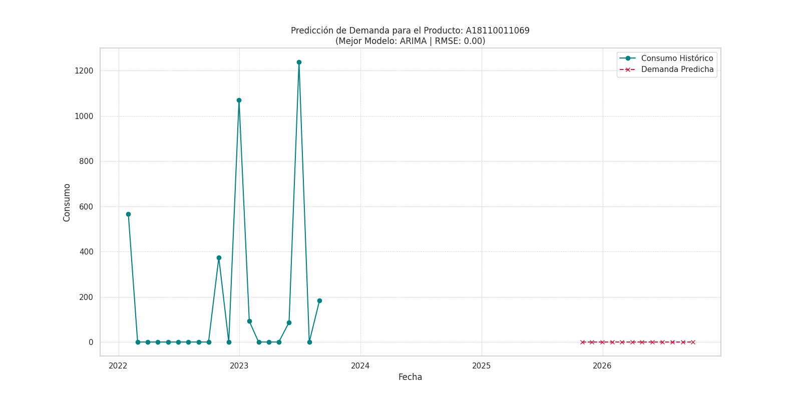
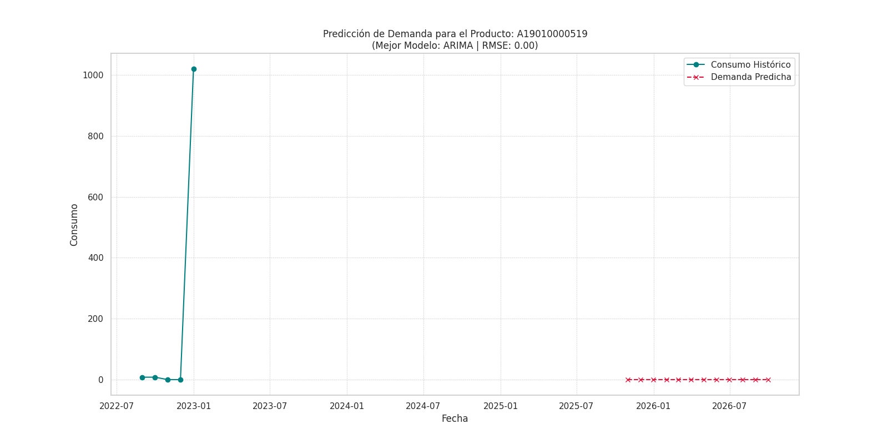
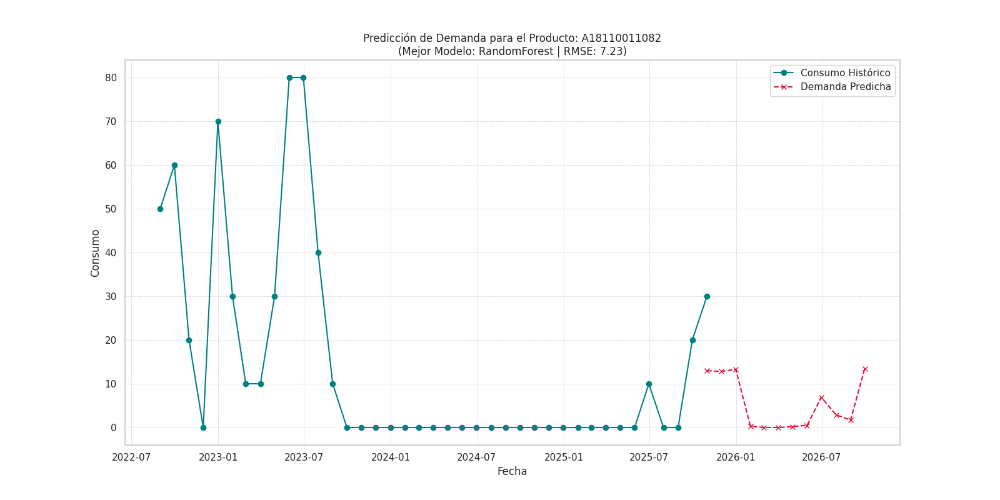
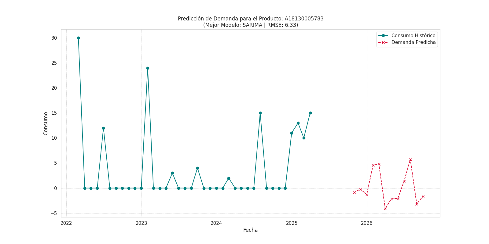

# Análisis y Predicción de Demanda para Planificación de Inventario

## 1. Resumen del Proyecto

Este proyecto analiza los datos históricos de consumo (2022-2025) de la línea de negocio "HIDRÁULICA COMPONENTE" para optimizar la planificación de inventario.

El enfoque se centra en **identificar los productos más críticos** (aquellos que generan el 80% del consumo) y desarrollar **predicciones de demanda individuales** para cada uno de ellos. Este método granular permite una gestión de stock mucho más precisa y eficiente.

El proceso incluye:
- **Análisis Exploratorio (EDA)** enfocado en el período 2022-2025, con visualizaciones anuales.
- **Identificación de Productos Clave** mediante un análisis ABC (Pareto).
- **Modelado Individual por Producto:** Se comparan 5 modelos de series temporales (ARIMA, SARIMA, XGBoost, RandomForest, Prophet) para cada producto clave.
- **Selección del Mejor Modelo y Predicción a 12 Meses** para cada artículo.
- **Visualización de Resultados** para los 5 productos más importantes.

---

## 2. Estructura del Repositorio

```
.
├── data/
│   └── kardexASTEC_filtrado.xlsx
├── output/
│   ├── consumo_mensual_2022.png
│   ├── consumo_mensual_2023.png
│   ├── ... (más gráficos)
│   ├── predicciones_por_producto.csv
│   └── productos_clave.txt
├── src/
│   ├── analisis_exploratorio.py
│   └── prediccion_por_producto.py
│   └── visualizar_predicciones.py
├── requirements.txt
└── README.md
```

---

## 3. Cómo Ejecutar el Proyecto

### a. Prerrequisitos
- Python 3.8 o superior.
- `pip` instalado.

### b. Pasos para la Ejecución
1. **Instalar las dependencias:**
   ```bash
   pip install -r requirements.txt
   ```

2. **Ejecutar los scripts en orden:**
   - **Paso 1: Análisis Exploratorio e Identificación de Productos**
     ```bash
     python3 src/analisis_exploratorio.py
     ```
   - **Paso 2: Entrenamiento y Predicción por Producto**
     *Este proceso puede tardar varios minutos, ya que entrena modelos para ~90 productos.*
     ```bash
     python3 src/prediccion_por_producto.py
     ```
   - **Paso 3: Visualización de Resultados para Productos Top**
     ```bash
     python3 src/visualizar_predicciones.py
     ```

---

## 4. Análisis Exploratorio (2022-2025)

### a. Consumo Mensual por Año
El análisis por año revela patrones y picos de demanda que varían anualmente, lo que refuerza la necesidad de un modelo que se adapte a estas fluctuaciones.


### b. Identificación de Productos Clave
El análisis ABC (Pareto) demostró que **90 de 666 productos (el 13.5%) son responsables del 80% del consumo total**. Este hallazgo es fundamental, ya que permite a la empresa centrar sus esfuerzos de planificación en un grupo manejable de artículos de alto impacto.

---

## 5. Predicción de Demanda por Producto

Para cada uno de los 90 productos clave, se realizó un "campeonato de modelos", donde ARIMA, SARIMA, RandomForest, XGBoost y Prophet compitieron. El modelo con el menor Error Cuadrático Medio (RMSE) fue seleccionado y utilizado para generar un pronóstico a 12 meses.

Este enfoque asegura que cada producto sea modelado con la técnica que mejor se ajusta a su patrón de demanda específico.

### Resultados para los 5 Productos Principales
A continuación se muestran los resultados para los 5 productos más consumidos:

**1. Producto: A18110011069**


**2. Producto: A19010000519**


**3. Producto: A18110011082**


**4. Producto: A22020000062**


**5. Producto: A18130005783**


*Las predicciones completas para los 90 productos se encuentran en `output/predicciones_por_producto.csv`.*

---

## 6. Conclusiones y Recomendaciones

### a. Hallazgos Clave
- **La demanda es altamente concentrada:** Un pequeño subconjunto de productos (13.5%) es vital para el negocio. La estrategia de inventario debe priorizar estos artículos.
- **No hay un "modelo único para todos":** Diferentes productos tienen diferentes patrones de demanda. La selección de modelos individuales (por ejemplo, ARIMA para un producto, XGBoost para otro) aumenta significativamente la precisión del pronóstico general.

### b. Recomendaciones Estratégicas
1.  **Inventario Diferenciado:** Utilizar las predicciones individuales para establecer **niveles de stock de seguridad dinámicos** para cada uno de los 90 productos clave. Los productos de menor consumo pueden gestionarse con políticas más simples (ej. punto de reorden).
2.  **Revisión y Re-entrenamiento Periódico:** La demanda puede cambiar. Se recomienda **ejecutar este análisis trimestralmente** para actualizar la lista de productos clave y re-entrenar los modelos con los datos más recientes.
3.  **Análisis de Causa Raíz:** Para los productos top con alta volatilidad, investigar las **causas de los picos de demanda**. ¿Corresponden a proyectos específicos, temporadas de pesca, o promociones? Integrar esta información puede mejorar aún más la precisión.
4.  **Gestión Proactiva:** Utilizar las predicciones para **anticipar futuras necesidades de compra** y negociar mejores condiciones con los proveedores basándose en pronósticos de volumen a mediano plazo.
