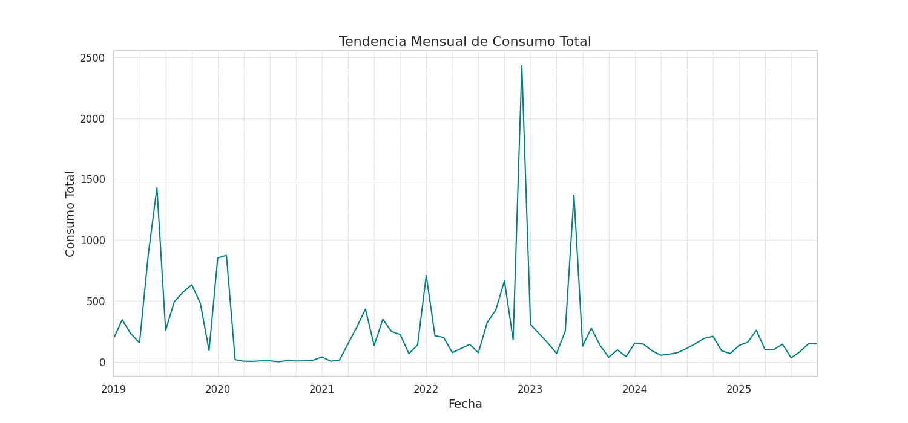
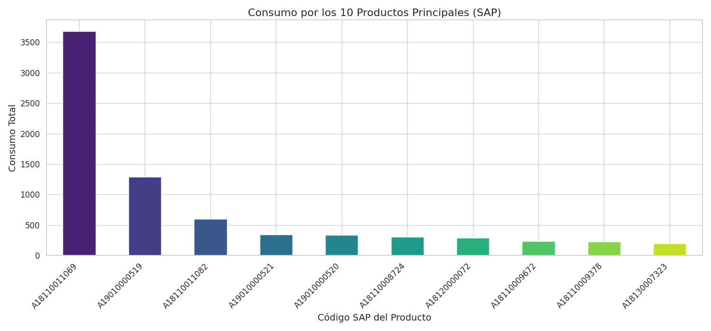
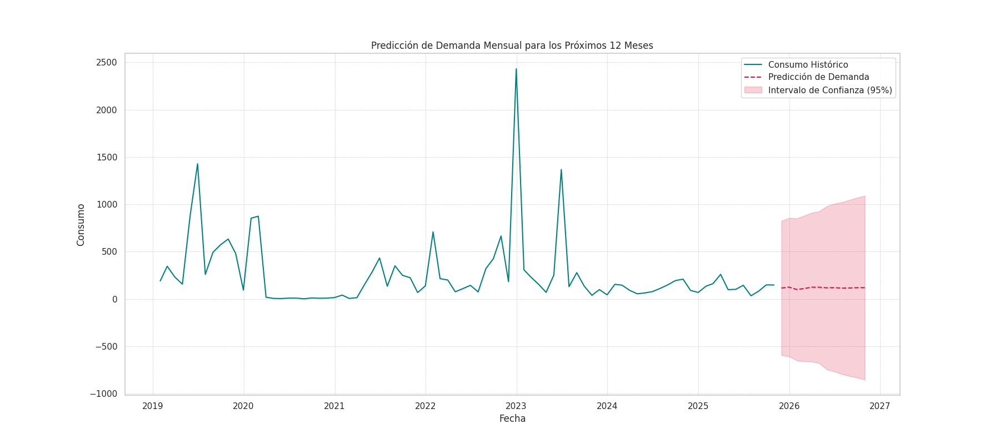

# Análisis y Predicción de Demanda para Productos de Pesca

## 1. Resumen del Proyecto

Este proyecto tiene como objetivo analizar los datos históricos de consumo de la línea de negocio "HIDRÁULICA COMPONENTE" del sector pesca para predecir la demanda mensual de sus productos.

El proceso completo incluye:
- **Análisis Exploratorio de Datos (EDA)** para identificar tendencias y patrones.
- **Implementación y Comparación de Modelos** de series temporales (ARIMA, SARIMA, XGBoost, RandomForest, Prophet).
- **Selección Automática del Mejor Modelo** basado en el error cuadrático medio (RMSE).
- **Generación de una Predicción** de la demanda para los próximos 12 meses.
- **Recomendaciones Estratégicas** para la gestión de inventario.

---

## 2. Estructura del Repositorio

```
.
├── data/
│   └── kardexASTEC_filtrado.xlsx   # Datos históricos de consumo (entrada)
├── output/
│   ├── evaluacion_modelos.csv        # Resultados de la evaluación de los modelos
│   ├── prediccion_demanda_pesca.csv  # Predicción final a 12 meses
│   ├── tendencia_consumo_mensual.png # Gráfico de tendencia mensual
│   ├── top_productos_consumo.png     # Gráfico de consumo por producto
│   └── prediccion_final_con_historico.png # Gráfico final con la predicción
├── src/
│   ├── analisis_exploratorio.py      # Script para el EDA
│   ├── entrenamiento_modelos.py    # Script para entrenar y evaluar modelos
│   └── generar_predicciones.py     # Script para generar la predicción final
├── requirements.txt                  # Dependencias de Python
└── README.md                         # Este archivo
```

---

## 3. Cómo Ejecutar el Proyecto

### a. Prerrequisitos
- Tener Python 3.8 o superior instalado.
- Tener `pip` (gestor de paquetes de Python) disponible.

### b. Pasos para la Ejecución
1. **Clonar el repositorio:**
   ```bash
   git clone <URL-del-repositorio>
   cd <nombre-del-repositorio>
   ```

2. **Instalar las dependencias:**
   ```bash
   pip install -r requirements.txt
   ```

3. **Ejecutar los scripts en orden:**
   - **Paso 1: Análisis Exploratorio** (genera los primeros gráficos en `output/`)
     ```bash
     python3 src/analisis_exploratorio.py
     ```
   - **Paso 2: Entrenamiento y Evaluación de Modelos** (compara modelos y guarda los resultados)
     ```bash
     python3 src/entrenamiento_modelos.py
     ```
   - **Paso 3: Generación de la Predicción Final** (usa el mejor modelo para predecir a 12 meses)
     ```bash
     python3 src/generar_predicciones.py
     ```

---

## 4. Análisis Exploratorio de Datos (EDA)

### a. Tendencia de Consumo Mensual
El consumo total mensual muestra una alta variabilidad, con picos significativos que podrían corresponder a las temporadas de pesca. No se observa una tendencia clara de crecimiento o decrecimiento a largo plazo, sino más bien un comportamiento cíclico.



### b. Productos con Mayor Consumo
Un número reducido de productos (identificados por su código SAP) concentra la mayor parte del consumo. El producto `A18110011069` es, con diferencia, el más demandado.



### c. Estadísticas Clave del Consumo Mensual
- **Media:** 256.2
- **Desviación Estándar:** 367.4 (indica alta volatilidad)
- **Mínimo:** 1.0
- **Máximo:** 2431.8

---

## 5. Comparación y Selección del Modelo

Se evaluaron cinco modelos diferentes para predecir la demanda. El **modelo ARIMA** fue seleccionado automáticamente como el mejor debido a su **Error Cuadrático Medio (RMSE)**, que fue significativamente más bajo que el de los otros modelos.

| Modelo       | MAE      | RMSE     | MAPE (%) |
|--------------|----------|----------|----------|
| **ARIMA**    | **53.18**| **70.84**| **39.49**|
| SARIMA       | 198.80   | 381.78   | 210.34   |
| RandomForest | 148.15   | 246.81   | 165.35   |
| XGBoost      | 160.70   | 269.67   | 141.76   |
| Prophet      | 115.05   | 140.10   | 113.62   |

*El **RMSE** es una métrica clave porque penaliza más los errores grandes, lo que es crucial para evitar grandes desviaciones en la planificación del inventario.*

---

## 6. Predicción de Demanda para los Próximos 12 Meses

El modelo ARIMA fue re-entrenado con todos los datos históricos para generar la siguiente predicción:



### Tabla de Predicción
A continuación se muestra la demanda predicha, junto con los intervalos de confianza del 95%.

| Fecha      | Predicción | Límite Inferior | Límite Superior |
|------------|------------|-----------------|-----------------|
| 2025-11-30 | 114.69     | -595.44         | 824.82          |
| 2025-12-31 | 124.35     | -607.57         | 856.26          |
| 2026-01-31 | 99.61      | -651.13         | 850.34          |
| 2026-02-28 | 108.78     | -660.95         | 878.51          |
| ...        | ...        | ...             | ...             |

*La tabla completa se encuentra en `output/prediccion_demanda_pesca.csv`.*

---

## 7. Conclusiones y Recomendaciones

### a. Mejor Modelo y Patrones Detectados
- **Mejor Modelo:** El modelo estadístico **ARIMA** superó a los modelos de machine learning y a Prophet. Esto sugiere que la demanda se explica mejor por sus propios valores pasados (autocorrelación) que por características de calendario complejas.
- **Patrones Estacionales:** Aunque el modelo SARIMA (diseñado para estacionalidad) no fue el mejor, los picos de demanda en el análisis exploratorio sugieren una fuerte relación con las **temporadas de pesca**. La alta volatilidad de la demanda es el principal desafío.

### b. Recomendaciones para la Empresa
1.  **Enfoque en Productos Clave:** Dado que pocos productos representan la mayor parte del consumo, la empresa debe centrarse en mantener un **stock de seguridad robusto** para los SAP `A18110011069` y `A19010000519`.
2.  **Monitoreo Continuo:** La predicción muestra una tendencia a estabilizarse, pero los intervalos de confianza son amplios debido a la volatilidad histórica. Se recomienda **re-entrenar el modelo mensualmente** con nuevos datos para ajustar las predicciones.
3.  **Integrar Variables Externas:** Para mejorar la precisión, se podría enriquecer el modelo con datos externos como:
    - **Calendarios de vedas y temporadas de pesca.**
    - **Datos macroeconómicos** del sector pesquero.
    - **Información de los clientes** sobre sus planes de operación.
4.  **Gestión de Inventario Flexible:** En lugar de confiar únicamente en la predicción media, la empresa debería utilizar los **intervalos de confianza** para planificar escenarios optimistas y pesimistas, ajustando los niveles de inventario de forma más dinámica.
