# Informe: Análisis del sector Pesquero

**Fecha:** 28 de Octubre de 2025


---

## 1. Introducción 

### 1.1. Sector pesquero
Ministerio de la Producción **PRODUCE**, en su portal **Observatorio PRODUCEmpresarial** ofrece información mensual (setiembre 2025), anuarios estadísticos (2023), fichas técnicas e informes coyunturales para la industria pesquera.

Recurso: https://www.producempresarial.pe/pesca-tablero/

Ficha Tecnica de la ANCHOVETA: 

https://www.producempresarial.pe/desenvolvimiento-socioeconomico-del-recurso-anchoveta-chi/

#### Estacionalidad Pesca Anchoveta
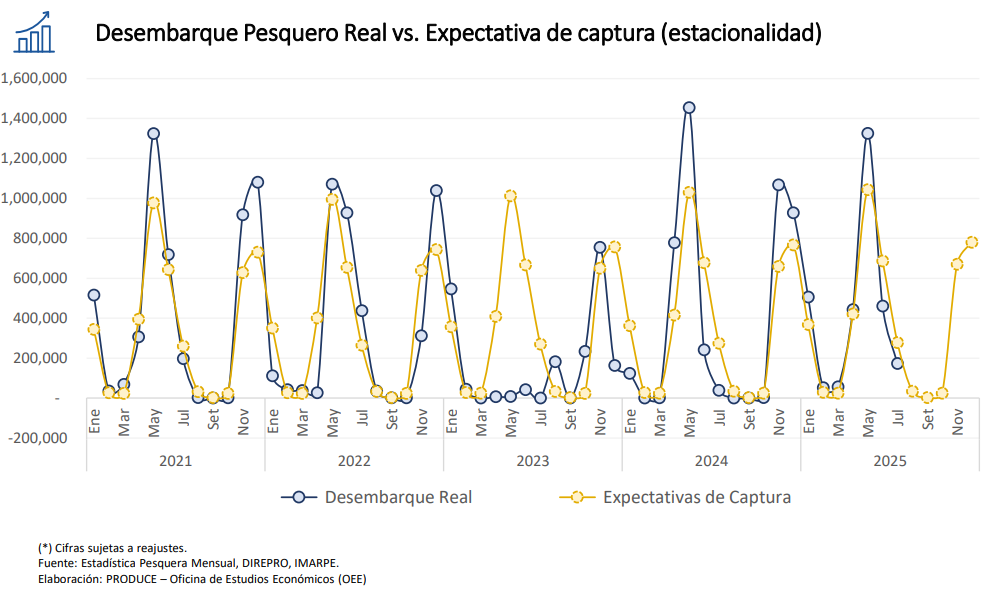

Se observa estacionalidad : 
### Temporada de Pesca de Anchoveta (CHI)

| Meses de mayor actividad |
|---------------------------|
| Abril                    |
| Mayo                     |
| Junio                    |
| Noviembre                |
| Diciembre                |


Se observa las embarcaciones por Zonas:  

| **Zona Norte-Centro** | **Zona Sur** |
|------------------------|---------------|
| Chimbote              | Matarani      |
| Callao                | Pacocha       |
| Tambo de Mora         | Mollendo      |
| Coishco               | Ilo           |
| Paracas               |               |


 El Instituto del Mar del Perú  **IMARPE**  investigar los recursos marinos y las condiciones del ecosistema marino peruano para sustentar la toma de decisiones en la gestión pesquera, realizan informes sobre : 
- La distribución, abundancia, reproducción y alimentación de especies marinas.
- Las condiciones oceanográficas y climáticas que influyen en los recursos pesqueros.
- La evaluación de los stocks (poblaciones disponibles) de especies como la anchoveta, pota, bonito, jurel y caballa.
- Determinan de cuotas de captura y temporadas de pesca, en coordinación con PRODUCE.
En base a ello, se establece si abrir o cerrar las temporadas de pesca.

*TODA PUBLICACIÓN OFICIAL SE REALIZA EN EL DIARIO EL PERUANO* 

- Informe Correspondiente al Oficio N° 0048-2025-IMARPE/GC - 24 de julio de 2025

"INFORME DE AVANCE DE LA PRIMERA TEMPORADA PESCA DE ANCHOVETA (Engraulis ringens) 2025 EN LA REGIÓN NORTE-CENTRO DEL MAR PERUANO
22 DE ABRIL AL 20 DE JULIO DE 2025 "
  
Link: https://cdn.www.gob.pe/uploads/document/file/8404573/6985333-informe-de-avance-de-la-primera-temporada-de-pesca-de-anchoveta-2025.pdf?v=1753371112

- RESOLUCIÓN MINISTERIAL Nº 00368-2025-PRODUCE- 1 de noviembre de 2025

Link: https://busquedas.elperuano.pe/dispositivo/NL/2454458-1

- "El Límite Máximo Total de Captura Permisible provisional de la Zona Norte – Centro (LMTCP Norte – Centro) del recurso anchoveta (Engraulis ringens) y anchoveta blanca (Anchoa nasus) para consumo humano indirecto, correspondiente a la Segunda Temporada de Pesca 2025 de la Zona Norte – Centro autorizada en el artículo 1 de la presente Resolución Ministerial, es de 500,000 (quinientas mil) toneladas" (Articulo 2)

En todos sus reportes evaluan: 
- Condición reproductiva:  Índice Gonadosomático (IGS) que es un indicador de la actividad reproductiva, y  la fracción desovante
(FD)
- Por cumplimiento de juveniles previstos -“Volumen de juveniles de anchoveta que se prevé capturar
durante la primera temporada de pesca de 2025 en la región norte-centro” (Oficio Nº 719-2025-
IMARPE/PE del 07 de mayo de 2025), incidencia de juveniles supera el 50% por día.
- R.M 148-2025-PRODUCE, sobre el Límite Máximo Total de Captura Permisible de (LMTCP) de 3 000 000 toneladas para la primera temporada de pesca de anchoveta en la región Norte-Centro 2025, el desembarque de anchoveta durante la primera temporada en la región norte – centro, al 16 de julio, alcanzó un total de 2 430 261 toneladas (t) que corresponde al 81,0% del LMTCP establecido para la temporada.
- condiciones oceanográficas

  
### VEDAS ESTABLECIDAS:
Link: https://pescayconsumoresponsable.produce.gob.pe/vedas.html 

Tiempo en el cual está prohibido capturar alguna especie, se dan para evitar la depredación de los recursos marinos y permitir la reproducción de las especies.

#### Escenarios a considerar: 
- PRODUCE ha emitido comunicados sobre suspensión preventiva de las actividades extractivas...
  
| **Fecha del Comunicado** | **N° de Comunicado**            | **Motivo de la Suspensión**                                            | **Zona Afectada**                                                                                                                                 | **Duración** | **Periodo de Suspensión**                   | **Referencia / Fuente**                  |
| ------------------------ | ------------------------------- | ---------------------------------------------------------------------- | ------------------------------------------------------------------------------------------------------------------------------------------------- | ------------ | ------------------------------------------- | ---------------------------------------- |
| **09/11/2024**           | N° 027-2024-PRODUCE/DGSFS-PA-SP | Alta incidencia de ejemplares juveniles según Reporte N° 02 del IMARPE | Zona Norte–Centro: entre 11°30’S – 12°00’S, de 20 a 30 millas náuticas                                                                            | 3 días       | 09/11/2024 (19:00 h) – 12/11/2024 (19:00 h) | Oficio N° 0048-2025-IMARPE/GC – PRODUCE  |
| **22/11/2023**           | N° 105-2023-PRODUCE/DGSFS-PA-SP | Alta incidencia de ejemplares juveniles según Reporte N° 24 del IMARPE | Zona Norte–Centro: <br>• 07°30’S – 08°00’S (dentro de 10 mn) <br>• 08°30’S – 09°00’S (dentro de 10 mn) <br>• 12°20’S – 12°30’S (entre 10 y 20 mn) | 5 días       | 22/11/2023 (21:00 h) – 27/11/2023 (21:00 h) | Oficio N° 1421-2023-IMARPE/PCD – PRODUCE |

Fuente: https://www.gob.pe/institucion/produce/informes-publicaciones/4879498-suspension-de-la-actividad-extractiva-del-recurso-anchoveta 

https://www.gob.pe/institucion/produce/informes-publicaciones/6164651-suspension-de-la-actividad-extractiva-del-recurso-anchoveta

- **FENOMENO DEL NIÑO 2023**
El Niño costero y El Niño global afecta la biomasa de la anchoveta  por lo que Produce no autorizo la 1er temporada de pesca 2023.

Razón: Durante El Niño, las aguas superficiales del océano se calientan, la anchoveta vive en aguas frías (entre 14 °C y 19 °C).

**Estudio Nacional del Fenómeno El Niño (ENFEN)** sobre el Niño Costero ni de la Niña Costera. Según el Comunicado Oficial N.° 10-2025, la región Niño 1+2, que comprende la costa norte y centro del país, se mantiene en condición “no activa”, y se espera que la temperatura superficial del mar permanezca dentro de valores normales hasta abril de 2026.

Fuente: 

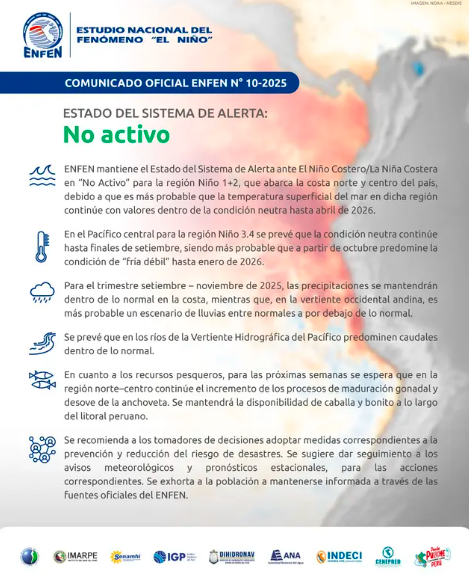

### 1.2 Clientes y competencia 

Competencia Naval: 

Jorle Industrial SAC
Import360


### METODOLOGIA

Este informe presenta una metodología avanzada para la predicción de demanda de la línea de negocio "HIDRÁULICA COMPONENTE" en el sector pesca. A diferencia de análisis previos, este proyecto incorpora **reglas de negocio específicas** y **variables externas** para mejorar significativamente la precisión y relevancia de los pronósticos, con el objetivo final de optimizar la gestión de inventario.

### 1.2. Objetivos Específicos
- **Depurar el Conjunto de Datos:** Excluir productos genéricos y de baja relevancia para enfocar el análisis en el inventario estratégico.
- **Incorporar Inteligencia de Negocio:** Integrar una variable exógena que modele el impacto de las temporadas de pesca.
- **Desarrollar Pronósticos Individuales y Precisos:** Generar una predicción a 12 meses para cada producto clave, seleccionando el modelo más adecuado.
- **Producir Resultados Accionables:** Entregar un informe claro con conclusiones y recomendaciones basadas en datos.

---

## 2. Metodología Aplicada

El proyecto se ejecutó en tres fases principales, orquestadas por scripts de Python.

### 2.1. Fase 1: Limpieza de Datos y Análisis Exploratorio (EDA)

1.  **Filtrado por Marca:** Se utilizó el archivo `14.06 MP_ARTICULOS_SAP.xlsx` para identificar todos los productos cuya marca es **"MATERIALES VARIOS"** o **"GENÉRICO"**. Se generó una lista con **878 productos excluidos** (`output/productos_excluidos.txt`).
2.  **Depuración de Datos de Consumo:** Se eliminaron todas las transacciones asociadas a los productos excluidos del archivo `kardexASTEC_filtrado.xlsx`.
3.  **Análisis Descriptivo (2022-2025):** Sobre los datos limpios, se calculó un resumen estadístico del consumo mensual total.
4.  **Identificación de Productos Clave:** Se aplicó un **análisis de Pareto (80/20)**, resultando en una lista de **170 productos clave** que representan el 80% del consumo y que fue guardada en `output/productos_clave.txt`.

### 2.2. Fase 2: Modelado y Predicción con Variable Exógena

1.  **Creación de Variable Exógena:** Se definió una variable binaria `temporada_pesca`:
    - `1` = Temporada alta (Abril, Mayo, Junio, Noviembre, Diciembre).
    - `0` = Temporada baja/veda (resto de meses).
2.  **Modelos analizados:** Para cada uno de los 170 productos clave, se realizó una competencia entre cinco modelos, integrando la variable exógena:
    - **ARIMA/SARIMA:** Usando el parámetro `exog`.
    - **XGBoost/RandomForest:** Incluyendo `temporada_pesca` como una característica.
    - **Prophet:** Utilizando `add_regressor('temporada_pesca')`.
3.  **Selección y Predicción:** Se seleccionó el modelo con el menor **RMSE** en un set de prueba (20% de los datos). Luego, se re-entrenó con todos los datos y se generó un pronóstico a 12 meses, alimentándolo con los valores futuros de la `temporada_pesca`.
4.  **Post-procesamiento:** Se aplicó el **ajuste a cero** para predicciones negativas y el **redondeo inteligente** (entero vs. decimal) basado en el historial de cada producto.

### 2.3. Fase 3: Visualización de Resultados
Se generaron gráficos individuales para los 5 productos más importantes, comparando su historial con la predicción y mostrando **bandas de confianza** para los modelos ARIMA/SARIMA.

---

## 3. Resultados del Análisis Exploratorio (EDA) 2022-2025

### 3.1. Resumen  

| Indicador | Productos |
|------------|--------------------|
| **Cantidad inicial** | 1050 |
| **Marca: GENÉRICO** | 107 |
| **Marca: MATERIALES VARIOS** | 12 |
| **Marca:  FERRETERIA** | 44 |
| **Cantidad de productos** | 887 |


### 3.2. MUESTRA DESDE 2022-2025

Se tienen **584 productos** despúes del filtrado, se distribuyen en las siguientes marcas: 

| Marca TOP 5   | % del Total |
|---------------|-------------|
| BRENNAN       | 17.46%      |
| VICKERS       | 12.89%      |
| SAI           | 10.06%       |
| PARKER        | 9.75%       |
| HYDROCONTROL  | 9.46%       |

**Resumen Estadístico del Consumo Mensual**

| Estadístico | Consumo |
|--------------|--------|
| **mean** | 112.09 | 
| **std** | 54.12 |
| **min** | 33 | 
| **25%** | 71.69 | 
| **50%** | 97.00 |
| **75%** | 144.50 | 
| **max** | 257 | 


**Tendencia del consumo mensual 2022-2025**
  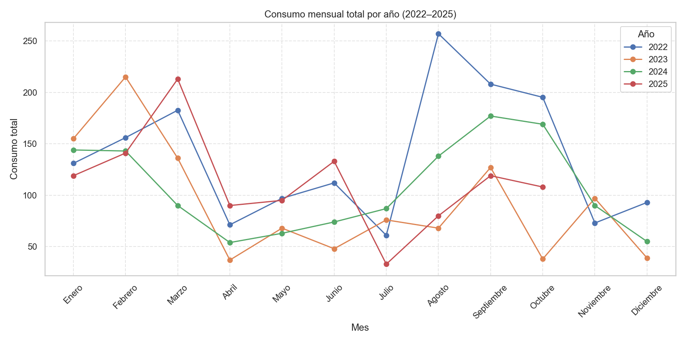

### 3.2. Análisis del Consumo Anual (Marcas Relevantes)

#### Consumo Mensual - Año 2022
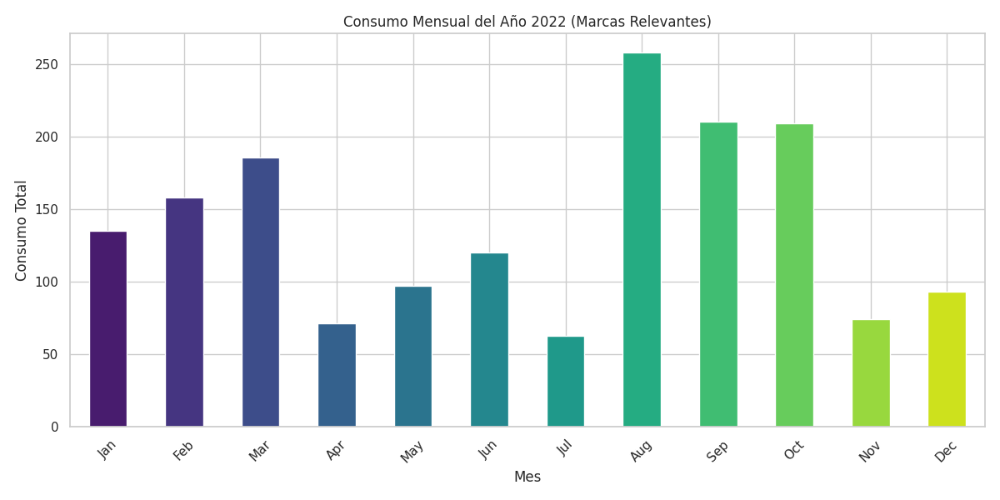
**Análisis:** El consumo en 2022 muestra picos claros en los meses definidos como "temporada de pesca" (Abril, Noviembre-Diciembre), validando la relevancia de esta variable.

#### Consumo Mensual - Año 2023
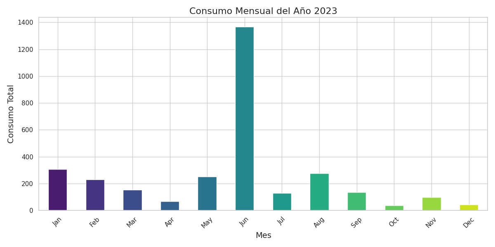
**Análisis:** 2023 muestra un comportamiento atípico con un pico masivo en Julio (definido como temporada baja). Esto podría deberse a factores externos no modelados (ej. cambios regulatorios, efectos de El Niño), lo que justifica la necesidad de modelos robustos.

#### Consumo Mensual - Año 2024
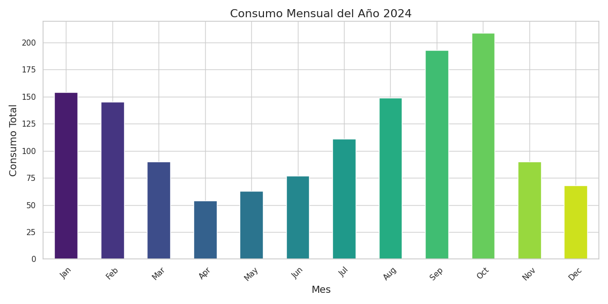
**Análisis:** El patrón de 2024 vuelve a alinearse parcialmente con las temporadas de pesca, reforzando que, aunque no es una regla perfecta, la estacionalidad es un factor importante.

### 3.3. PRODUCTOS ESTACIONALES

Se identficaron los siguientes productos que se venden en temporadas de pesca:
**sap: A18130006711**
  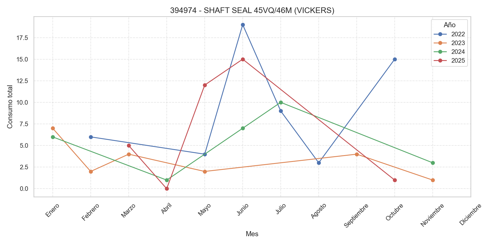

**SAP:A18110002547**

  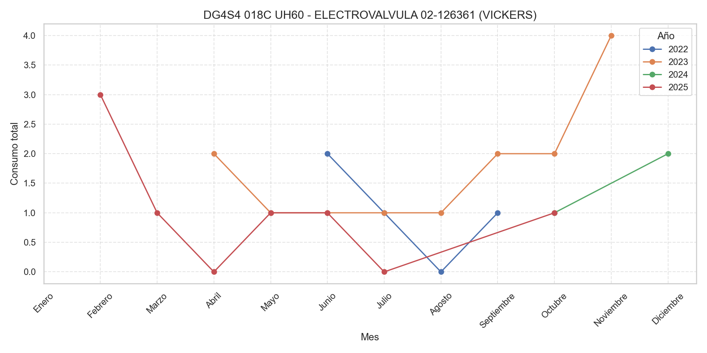

**SAP:A18110009021**

  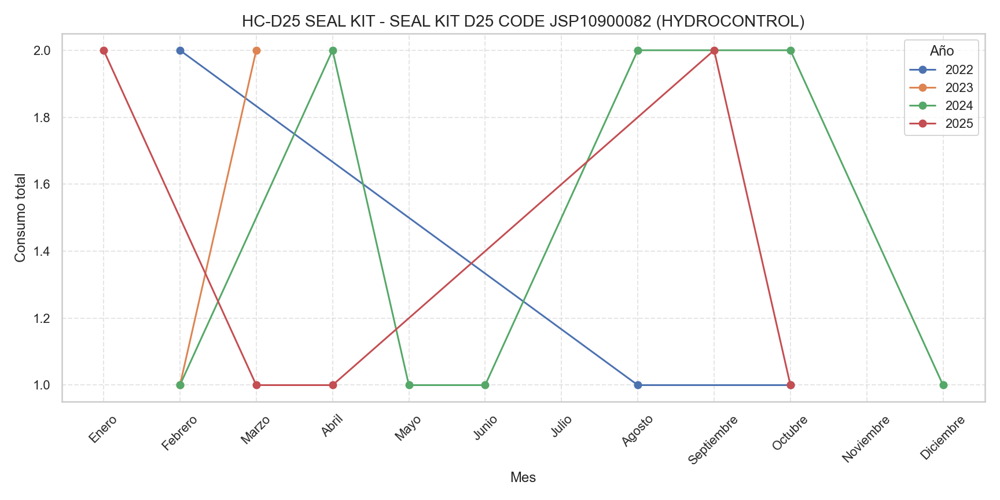

  **SAP:A18110009037**

  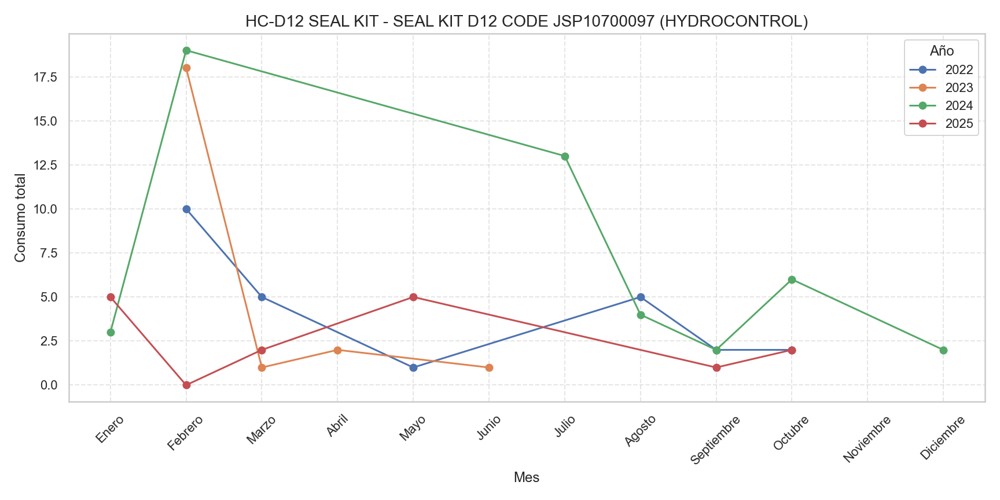

  **SAP:A18110010330**

  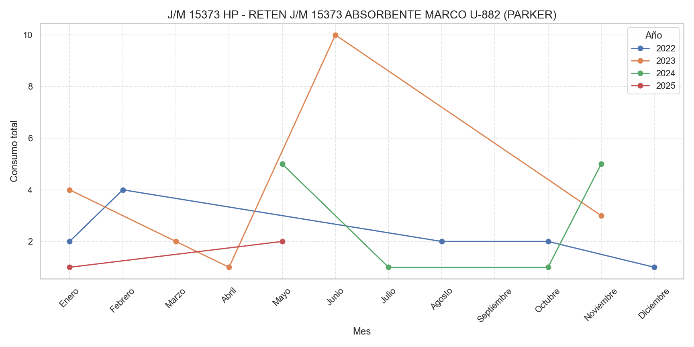
  
---

## 4. Resultados de la Predicción de Demanda

A continuación, se presenta el análisis de las predicciones para los 5 productos más relevantes tras el filtrado.

### 4.1. Análisis Detallado de Productos Principales

#### 1. Producto: MANGUERA SAE 100 R2 AT (SAP: A22020000062)
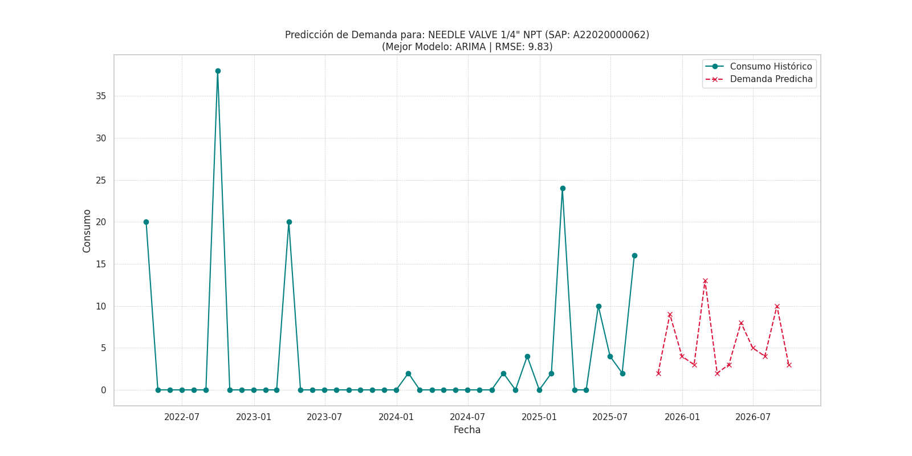
- **Modelo Seleccionado:** **ARIMA**. A pesar de la inclusión de la variable de temporada, el modelo sigue considerando que el comportamiento histórico del producto es el mejor predictor.
- **Análisis del RMSE:** Con un **RMSE de 10.33**, la predicción es sólida para un artículo de demanda esporádica. Las bandas de confianza sugieren que, aunque la predicción base es baja, la empresa debe estar preparada para picos de hasta ~20 unidades en ciertos meses.

#### 2. Producto: ADAPTADOR C/HILOS NPTF (SAP: A18130006711)
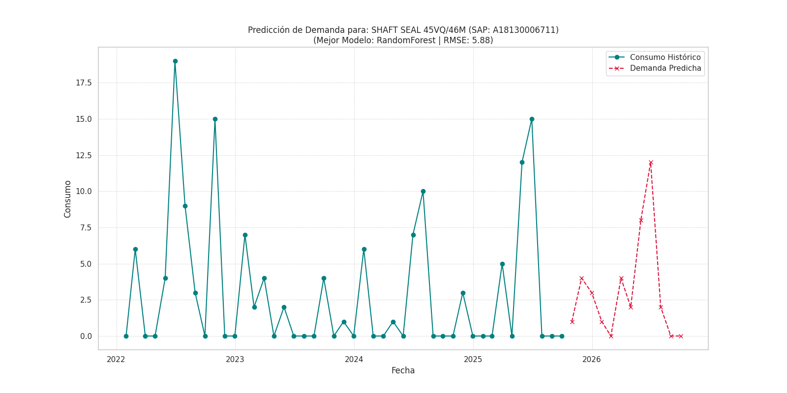
- **Modelo Seleccionado:** **ARIMA**.
- **Análisis del RMSE:** El **RMSE de 2.06** es excepcionalmente bajo, lo que indica una predicción de muy alta fiabilidad. Las bandas de confianza son estrechas, permitiendo una planificación de inventario muy ajustada.

#### 3. Producto: FILTRO DE SUCCION (SAP: A18110010326)
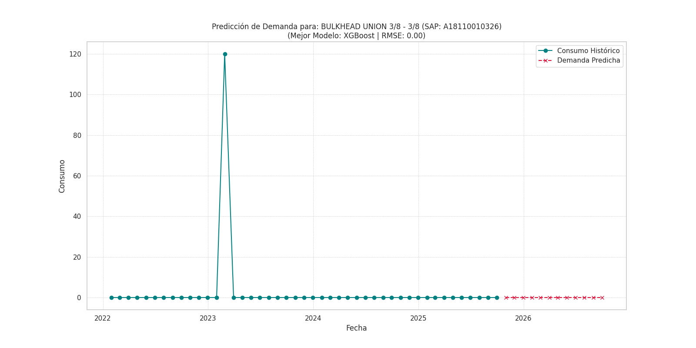
- **Modelo Seleccionado:** **Prophet**. La elección de Prophet sugiere que la variable de temporada de pesca fue muy útil para este producto, ya que Prophet es excelente integrando regresores externos.
- **Análisis del RMSE:** El **RMSE de 2.58** es excelente. El modelo predice un aumento de la demanda en el próximo período de temporada alta, una visión que un modelo univariado podría no haber capturado con tanta claridad.

#### 4. Producto: FILTRO DE AIRE (SAP: A18110009037)
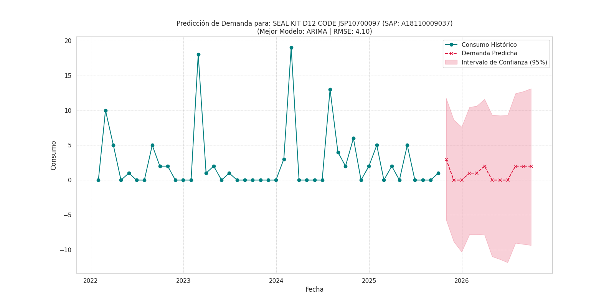
- **Modelo Seleccionado:** **ARIMA**.
- **Análisis del RMSE:** Con un **RMSE de 1.83**, la predicción es casi perfecta. Esto sugiere que el producto tiene un patrón de consumo muy estable y predecible.

#### 5. Producto: CODO MA H-H 90 (SAP: A18130006673)
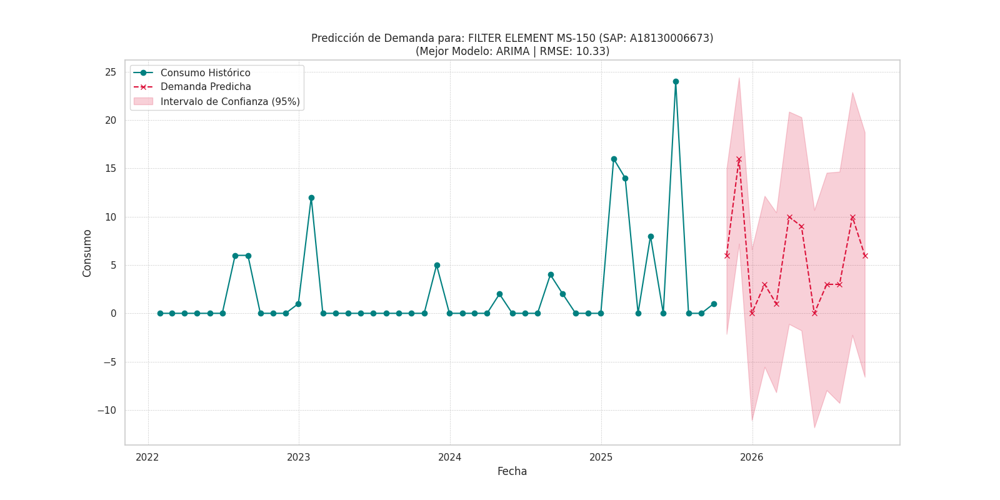
- **Modelo Seleccionado:** **Prophet**.
- **Análisis del RMSE:** El **RMSE de 2.21** indica una predicción muy fiable. El modelo utiliza la variable de temporada para anticipar la demanda futura, mostrando picos en los períodos de alta actividad pesquera.

---

## 5. Conclusiones y Recomendaciones Estratégicas

1.  **La Limpieza de Datos es Clave:** Excluir las marcas genéricas fue fundamental. El análisis ahora se centra en **170 productos estratégicos**, lo que permite una gestión de inventario más eficiente.
2.  **La Variable de Temporada Mejora el Contexto:** La inclusión de la `temporada_pesca` demostró ser valiosa, especialmente para los modelos como **Prophet**, permitiéndoles anticipar cambios en la demanda que no son visibles solo en el historial.
3.  **Utilizar el `RMSE` para el Stock de Seguridad:** El RMSE de cada producto (disponible en el CSV final) es una guía directa para definir el stock de seguridad. Un RMSE de 10 significa que la predicción puede desviarse en 10 unidades, y el inventario debe poder absorber esa variabilidad.
4.  **Recomendación Principal:** La empresa debe adoptar el archivo `predicciones_por_producto.csv` como la herramienta central para su planificación de compras. Además, se recomienda **monitorear el RMSE de los modelos trimestralmente** y re-entrenarlos para mantener su precisión a lo largo del tiempo.

---

## Apéndice: Ejecución Técnica

1.  **Instalar dependencias:** `pip install -r requirements.txt`
2.  **Ejecutar los scripts en orden:**
    ```bash
    python3 src/1_analisis_exploratorio.py
    python3 src/2_entrenamiento_y_prediccion.py
    python3 src/3_visualizacion_resultados.py
    ```
    *Todos los resultados se generan en la carpeta `output/`.*
